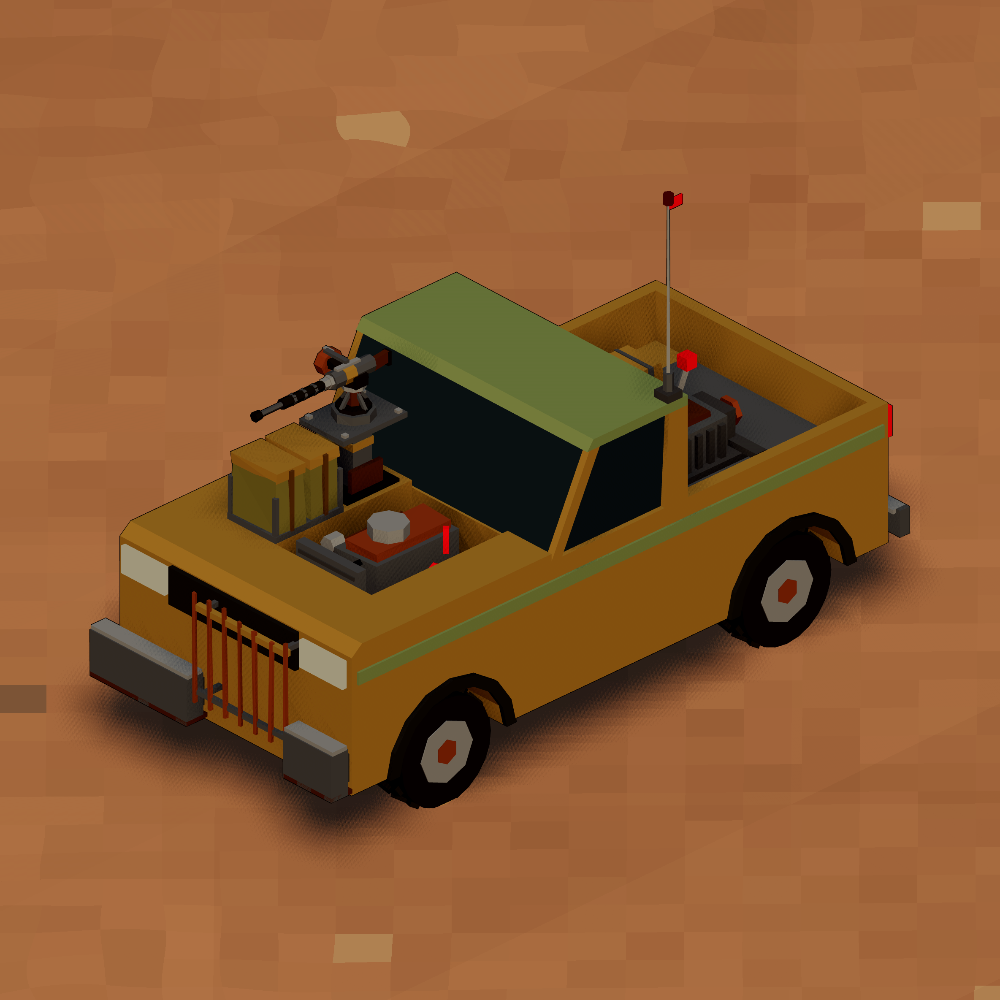

# ROAM - Road Machiners

A community-driven wasteland truck RPG and software factory.


In ROAM you drive an armed truck across a post-apocalyptic wasteland. It's an immersive RPG sandbox: trade, scavenge ancient ruins, take jobs, rob other drivers or protect them. Inspired by Ex Machina, Space Rangers 2, Kenshi, Dustland 

## The software factory

Imagine you could play the game, leave a feature request and see it appear in a few days? We have that in ROAM.

ROAM is built in public by a software factory of AI coding agents.

1. Anyone can file a feature request or a bug areport as a [GitHub issue](https://github.com/btseytlin/road-machiners/issues). If the issue gets enough votes from the community, coding agents start working on it.
2. Agents triage the top issues, then design, build and test them.
3. A human committee plays each result and approves or denies it.
4. Approved work goes to the [dev build](https://roam-game.online/dev/) at once and ships to [itch.io](https://btseytlin.itch.io/road-machiners) as a weekly release.
5. A Hermes agent manages the factory and fixes its failures.

The [factory dashboard](https://roam-game.online/factory/) shows live work, costs and how long each card takes. 

## Links

- [Play the release on itch.io](https://btseytlin.itch.io/road-machiners)
- [Play the dev build](https://roam-game.online/dev/), which has every approved change before release.
- [Factory dashboard](https://roam-game.online/factory/)
- [Telegram channel](https://t.me/roam_game_dispatch)
- [File an idea](https://github.com/btseytlin/road-machiners/issues/new)


## Layout

- `game/` holds the game. Start with `game/CLAUDE.md` and `game/docs/DESIGN.md`.
- `factory/` holds the factory. Start with `factory/README.md`.
- `quality/` holds the pre-commit quality gate. See `quality/README.md`.


## Run the game

```
cd game
npm ci
npm run dev
```

The game opens at [http://localhost:5173](http://localhost:5173).

## Contribute

Run `npm ci` at the root. Then run `npm run hooks:install` from the main checkout. The hook blocks new lint and type debt.