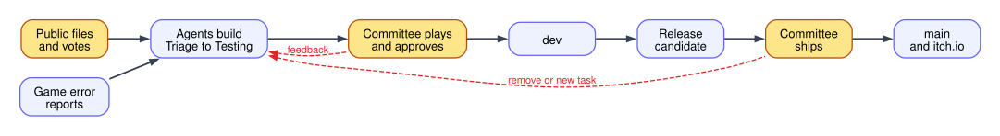
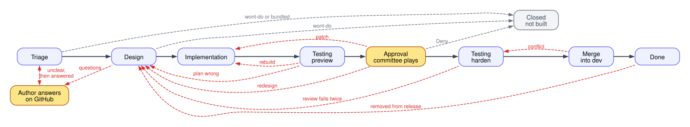
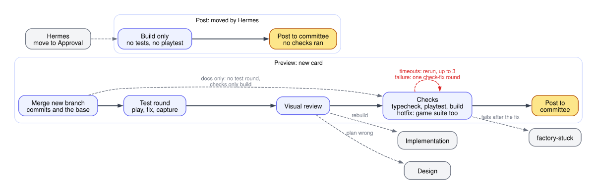
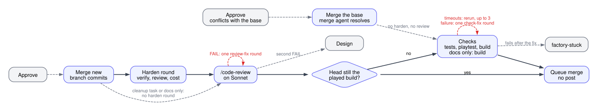
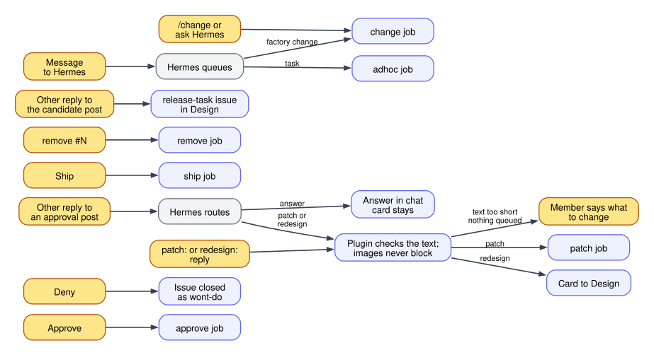
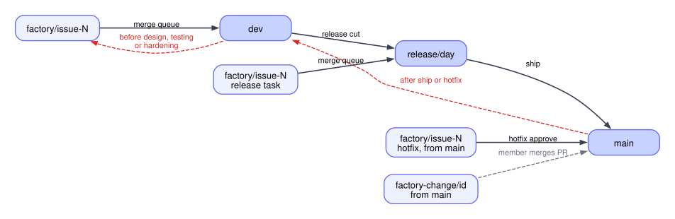
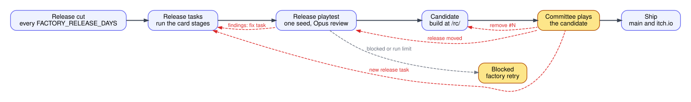
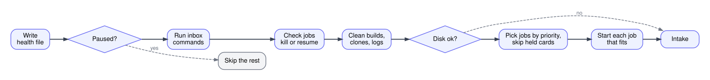

# Factory process

This file is the spec of how the factory works. Each diagram matches the code, and a change to the process updates its diagram in the same commit. The rules behind each step are in [stages.md](stages.md), [evidence.md](evidence.md) and [operations.md](operations.md). [state.md](state.md) describes the stores, card positions, queues and health records.

The diagrams are Graphviz files in [diagrams/](diagrams/). Agents read the `.dot` source. People see the `.svg` render. After you edit a `.dot` file, run `npm run diagrams` from `factory/`, or a test fails. It needs Graphviz installed. The colors mean the same in every diagram:

- Black arrows are the normal path, from left to right.
- Red dashed arrows are loops back.
- Grey dashed arrows end the flow early or leave it.
- Yellow boxes wait for people.

## Overview

The public files and votes on GitHub issues. Agents design, build and test the top ones. The committee plays each result in Telegram and approves it. Approved work collects on `dev` and ships as a release to `main` and itch.io. Hermes handles every failure.

## Card lifecycle

A card is one GitHub issue on the Project board. Its column is the state. Testing is a quick preview before the committee plays the card. Hardening runs after they approve it, with the deep verification and the review. Hardening is slow, so it runs only on work the committee wants.

- A bug a collaborator labels `hotfix` skips Triage. Triage can also label a bug `hotfix`. Approve ships a hotfix at once.
- Triage labels a fix of an open release's feature `release-task`, until the release's candidate is posted. It runs on the release branch and ships with that release. New work stays on `dev` for the next release.
- A merged issue stays open with the label `release-candidate`. It closes when its release ships.

The loops:

- unclear and questions: the author gets questions and the label `needs-info`. The tick removes the label once someone answers on GitHub, or once `FACTORY_NEEDS_INFO_HOURS` pass with no answer. Triage then runs again. With no answer it picks the most sensible reading, and design writes each open question and its reading into the design comment as an assumption.
- rebuild: the visual review found a shape, state or behavior that needs new code. The card keeps its branch.
- plan wrong: the visual review found the plan contradicts the issue or the game docs. The card keeps its branch.
- patch: a small committee change. The patch goes straight to the checks, with no testing agent. A patch that finds the plan must change goes to Design.
- redesign: the committee reply changes the plan.
- review fails twice: the code review blocked the change after one fix round. The approval is dropped, so the new build gets a new post.
- conflict: `dev` moved on since testing. The card goes back to Hardening with its approval kept. A merge agent resolves the conflict, and the checks run again with no new harden round or review.
- removed from release: `remove #N` on the release candidate post.

The early ends:

- wont-do: triage or design refuses the request, and the issue closes.
- bundled: triage folds the issue into a lead, and it closes when the lead ships.
- Deny: the committee rejects the build, and the issue closes.

Screenshots never block a card. A card with no screenshot still runs verify and the checks, and its approval post is text that says it has no screenshot. [evidence.md](evidence.md) has the rules.

A failed job never moves a card. It labels the issue `factory-stuck`, and the card waits in its column until Hermes removes the label. A run that hits the Claude weekly usage limit pauses the factory instead, and its card takes no label.

Every column change writes a card line to the ledger, named by its arrow in the diagram. The public dashboard reads these lines for its delivery numbers. [operations.md](operations.md#ledger-and-waste-review) lists the names.

Hermes can put a card in any position with `factory move`. The move clears the state of the old position, so every store agrees on the new one. [state.md](state.md) lists the positions.

## Testing column

Testing is two jobs. Verify runs the testing agent. Checks runs the machine checks with no agent. A third phase, post, builds and posts the branch with no tests. Only Hermes starts it, when it moves a card to Approval.

- A hotfix runs the harden round and the review, then the preview test round, before its post, since Approve ships it at once. It never enters Hardening.
- The visual review sends a card back at most twice. A third send-back fails the stage.

## Hardening column

Approve moves a card to Hardening. It runs the harden round and the review, and no test that Testing already ran. The card keeps the build the committee played. If hardening left the branch head on that build, the card goes straight to Approval with its merge queued. If hardening changed the code, Checks runs first.

- A release cleanup task goes from Implementation straight to Hardening, since it merges with no post. It has no played build, so Checks always runs.
- A conflict at approve sends the card back to Hardening. A merge agent resolves it, and Checks runs, with no harden round or review.
- A card that the review already sent to Design once fails the stage on its next second FAIL.

## Committee inputs

Members talk to the bot in the committee chat. The Hermes plugin turns commands into files in `$FACTORY_HOME/inbox`, and the next tick runs them before it starts jobs.

Hermes acts for a member with the member's Telegram id. A route or a task that Hermes gives on its own reading, like an incident task from the incident watch, carries `by` `hermes` and answers no chat message. The tick accepts `hermes` for a task and a route. Approve, deny, Ship, Remove and a change request need a member, and so do the button presses. The plugin still drops every message from a user outside the committee.

A reply that gets no route within `FACTORY_REPLY_ROUTE_MINUTES` becomes a failure with no issue, so Hermes sees it. Its text names the issue and tells Hermes to route the reply on its best reading. The card gets no stuck label.

A patch or a redesign queues when its text has at least `FACTORY_ROUTE_MIN_WORDS` words, so it names what to change. The plugin checks this for Hermes's route and for a member's `patch:` or `redesign:` reply. A shorter text queues nothing, and the plugin tells Hermes or the member why. Images never block a route.

- A member's Telegram images reach the agent best effort. The plugin copies each file of a reply to an approval post from Hermes's cache into `$FACTORY_HOME/inbox/media/post-<post>/`. A file it cannot copy leaves a note with the reason, and the plugin logs it.
- A patch or a redesign route moves the post's files into the issue's media folder. The tick checks each file with the rules of `src/media.ts`. The feedback comment lists each image by type, size and sha256, or as not available with the reason. The pixels never reach GitHub. An answer leaves the files for a later route. Approve, deny and a route delete the files of the closed post.
- An image that is missing, unreadable or on the issue but not downloadable is fetched once more. If it still fails, it is marked NOT AVAILABLE in the agent's prompt. The agent works from the text, writes down what it could not see and never describes an image it did not get. No stage stops for it.
- An image the agent lacks matters only when the text leaves a visual detail open. The patch agent then takes the most sensible reading of the text and writes it into the manifest description.
- `.factory/needs-committee.md` is for a game design fork or a major save bump only. An unclear plan, a missing image or a failing tool never justify it. The agent picks the most sensible reading and writes the assumption into the task file.

A reference that arrives while the card is in Design waits. The running design already read its images, so nothing interrupts it. The next stage reads every image on the issue again, and a member who needs the design to see it replies `redesign:` at the approval post.

## Branches

Every branch lives on GitHub. Each merge runs in a throwaway worktree and pushes at once. Steps that move several branches push them in one atomic push, so a failed push moves nothing.

Members, other jobs and releases push all the time, so any branch may move while a job runs. A moved branch never fails a job.

- An agent stage merges the new commits of its issue branch into the work before each push. When GitHub rejects the push because the branch moved again, it merges again and pushes again.
- A conflict with those commits goes to an agent in the same job. The agent keeps both sides, and the stage goes on. An unfinished merge fails the stage.
- Verify and patch also merge those commits before their agent starts, so the round tests them.
- A merge into `dev`, `main` or the release that GitHub rejects because a target moved runs again on the new tips.
- A conflict between whole branches never stops the factory. It covers the release cut, Ship, the hotfix fan-out and the reverts of Remove. The step keeps the conflicted merge in a work clone of the target, and an agent resolves it with `prompts/merge-branches.md`, or `prompts/revert-merge.md` for a revert. The factory checks that the commit finished the merge and that the agent's own changes pass the diff checks. Then the step pushes as before. A target that moved meanwhile gets the merge again, and a new agent round only if that conflicts too. A conflict of an issue branch with its base still goes back to Hardening.

- The release cut merges `main` into `dev` first when `dev` lacks any of it. It opens a tracking issue labeled `release` and two cleanup tasks. `lastRelease` changes only when the cut succeeds or finds nothing new, so a failed cut runs again on the next tick.
- Ship merges `main` into the release, the release into `main` and `main` into `dev` in one push. Then it builds `main` and pushes it to itch.io. A game change on `main` that the release lacks is merged into the release at once instead, and Ship stops. The release moved, so a new candidate follows for the committee to play.
- A hotfix merges its branch into `main`, and `main` into `dev` and the open release, in one push. Then it ships like a release.
- Remove reverts a feature's merge in both `dev` and the release, and sends its issue back to Design.

## Release

The playtest plays one seed of the progression harness on the release head, after every release task merged and before the candidate. An Opus agent reviews the whole log. A clean run passes that commit. Findings open a release fix task, and the same seed plays again on the new head. A blocked verdict or the run limit blocks the release for a member. [stages.md](stages.md#release-playtest) has the rules.

The candidate builds only the commit the playtest passed, and its post records it. Every move of the release drops the Ship button of the current post, and the playtest runs again on the new head. A reply can open a release task while a candidate builds. That candidate lacks the task, so it is not posted.

## Side jobs

These jobs run beside the cards.

- change: a factory change from `/change`, Hermes or the waste review. The agent runs up:make in hands-off mode on a clone of `main`, may edit any file in the repo and the factory opens a pull request. A member merges it.
- adhoc: one-off work a member asks Hermes for. The agent runs in a clone of `dev`, pushes nothing and replies with a report and files.
- incident: after a shipped fix of a `bug` issue or a hotfix. The agent judges the bug against the bar in `docs/incident-log.md` and may add an entry to `dev`.
- waste: every `FACTORY_WASTE_REVIEW_DAYS`. The agent reads the ledger numbers beside the period before and names one bottleneck. Hermes gets it and tells the committee only what matters.
- dev: rebuilds `/dev/` when `dev` moved past its build.

## Tick and queues

A timer runs one tick at a time. A tick never waits for a job. Each job runs as its own process. Check jobs kills a job past its time limit, and resumes a dead job once.

Jobs pick in this order. A job starts when its queue has a free worker and no other job works on its issue.

1. Branch jobs: queued approve, remove, ship, incident, then a stale `/dev/`, the release cut, and the release playtest or the candidate. The playtest runs in the verify queue.
2. The waste review, when due.
3. Card jobs: hotfixes, ad hoc tasks, factory changes, release tasks, then other cards. Within each, the card furthest along goes first.

Queues:

- triage: triage and the waste review.
- design: design.
- implement: implementation, patch, ad hoc and change.
- verify: the testing agent and the release playtest.
- test: the checks.
- branch: approve, remove, ship, incident, release cut, candidate and dev, one at a time.
