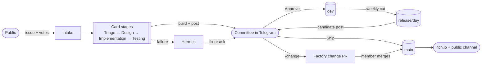
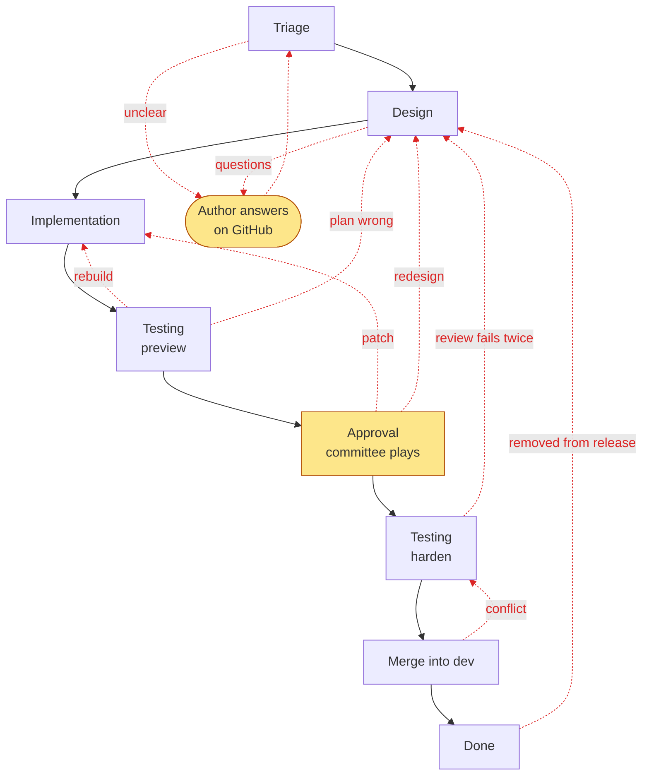
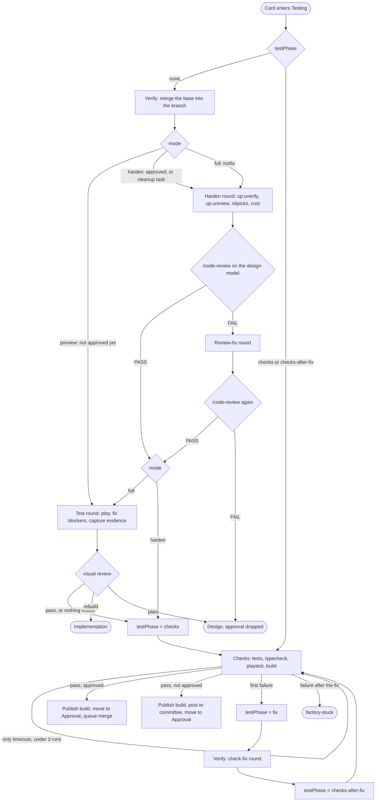
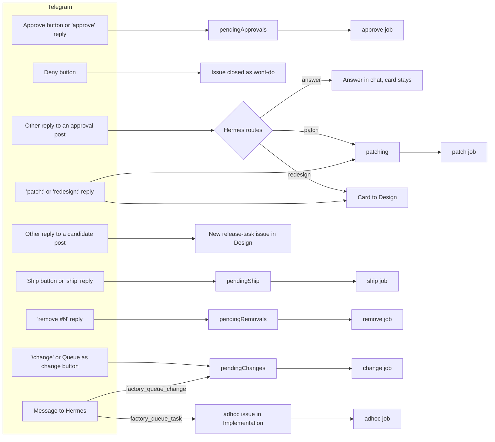
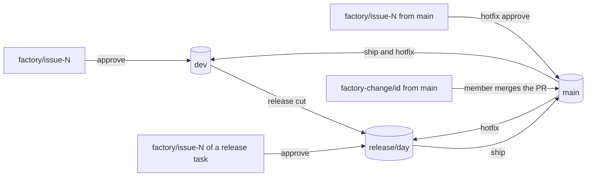
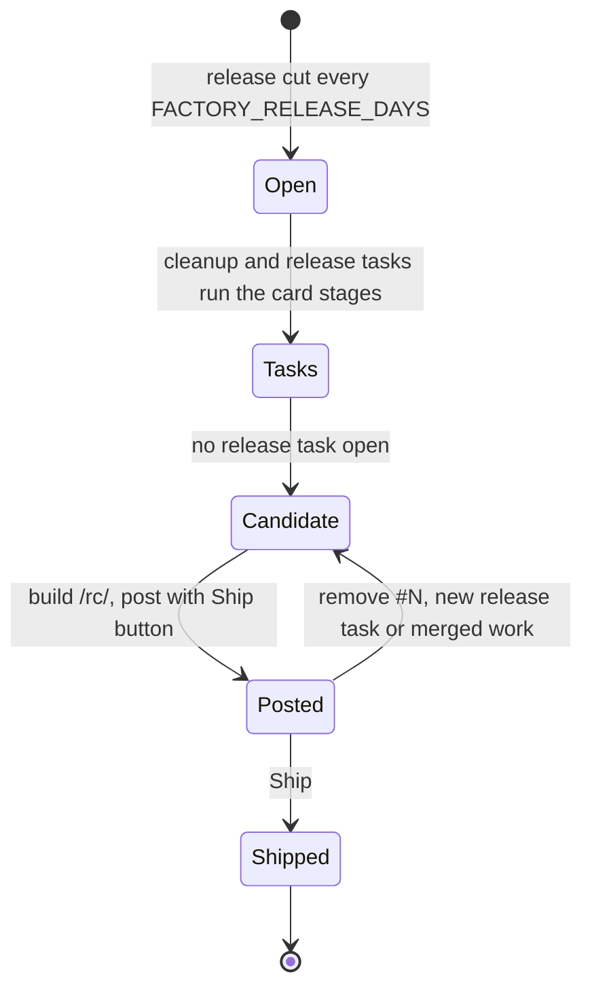
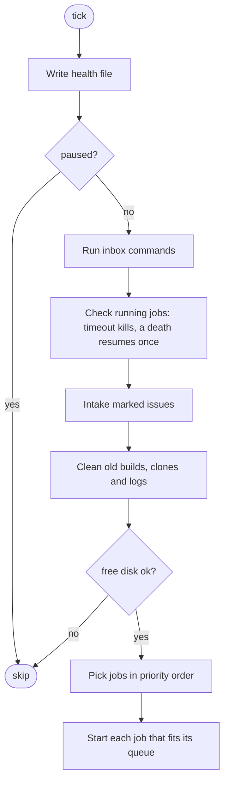

# Factory process

This file is the spec of how the factory works. Each diagram matches the code, and a change to the process updates its diagram in the same commit. The rules behind each step are in [stages.md](stages.md), [evidence.md](evidence.md) and [operations.md](operations.md).

## Overview

The public files and votes on GitHub issues. Agents design, build and test the top ones. The committee plays each result in Telegram and approves it. Approved work collects on `dev`, ships as a weekly release to `main` and itch.io, and Hermes handles every failure.

## Card lifecycle

A card is one GitHub issue on the Project board. Its column is the state. A card passes Testing twice: a quick preview before the committee plays it, and a full hardening after they approve it.

Black arrows are the normal path. Red dotted arrows are the loops back. Yellow steps wait for people.

- A hotfix skips Triage. It runs preview and harden before its post, and Approve ships it at once.
- A merged issue stays open with the label `release-candidate`. It closes when its release ships.

### The loops

- unclear and questions: the author gets questions and the label `needs-info`. The tick removes the label once someone answers on GitHub, and triage runs again.
- rebuild and plan wrong: the visual review found the look wrong. The card keeps its branch.
- patch: a small committee change. The patch goes straight to the checks, with no testing agent. A patch that finds the plan must change goes to Design.
- redesign: the committee reply changes the plan.
- review fails twice: the code review blocked the change after one fix round. The approval is dropped, so the new build gets a new post.
- conflict: `dev` moved on since testing. The approval is kept, and hardening runs again.
- removed from release: `remove #N` on the release candidate post.

### How a card ends early

- Triage or Design → Done: the request is wont-do, and the issue closes.
- Triage → Done: the issue is bundled into a lead and closes when the lead ships.
- Approval → Done: the committee presses Deny, and the issue closes.

A failed job never moves a card. It labels the issue `factory-stuck`, and the card waits in its column until Hermes removes the label.

## Testing column

Testing is two jobs. Verify runs the testing agent in the verify queue. Checks runs the machine checks with no agent in the test queue. The `testPhase` entry of the card in the state file says which job runs next.

Limits:

- A card gets one review-fix round per hardening, and one trip back to Design for the review. A second review redesign fails the stage.
- A card gets two visual send-backs. A third fails the stage.
- A check failure gets one fix round. A second failure fails the stage.
- Checks that fail only on timeouts run up to 3 times with no agent.

## Committee inputs

Members talk to the bot in the committee chat. The Hermes plugin turns commands into files in `$FACTORY_HOME/inbox`, and the next tick runs them before it starts jobs.

A reply that gets no route within `FACTORY_REPLY_ROUTE_MINUTES` becomes a failure, so Hermes sees it.

## Branches and releases

Every branch lives on GitHub. Each merge runs in a throwaway worktree and pushes at once. Steps that move several branches push them in one atomic push, so a conflict moves nothing.

- The release cut merges `main` into `dev` first when `dev` lacks any of it. It opens a tracking issue labeled `release` and two cleanup tasks.
- Ship merges `main` into the release, the release into `main` and `main` into `dev` in one push. Then it builds `main` and pushes it to itch.io.
- A hotfix merges its branch into `main`, and `main` into `dev` and the open release, in one push. Then it ships like a release.
- Remove reverts a feature's merge in both `dev` and the release, and sends its issue back to Design.

## Release

Every merge into the release drops the Ship button of the current post. A build that finds a new release task is not posted.

## Side jobs

These jobs run beside the cards.

- change: a factory change from `/change`, Hermes or the waste review. The agent runs up:make in hands-off mode on a clone of `main`, edits only `factory/` and the factory opens a pull request. A member merges it.
- adhoc: one-off work a member asks Hermes for. The agent runs in a clone of `dev`, pushes nothing and replies with a report and files.
- incident: after a shipped fix of a `bug` issue or a hotfix. The agent judges the bug against the bar in `docs/incident-log.md` and may add an entry to `dev`.
- waste: every `FACTORY_WASTE_REVIEW_DAYS`. The agent reads the ledger numbers and posts one bottleneck with a "Queue as change" button.
- dev: rebuilds `/dev/` when `dev` moved past its build.

## Tick and queues

A timer runs one tick at a time. A tick never waits for a job. Each job runs as its own process.

Jobs pick in this order. A job starts when its queue has a free worker and no other job works on its issue.

1. Branch jobs: queued approve, remove, ship, incident, then a stale `/dev/`, the release cut and the candidate.
2. The waste review, when due.
3. Card jobs: hotfixes, ad hoc tasks, factory changes, release tasks, then other cards. Within each, the card furthest along goes first.

Queues:

- triage: triage and the waste review.
- design: design.
- implement: implementation, patch, ad hoc and change.
- verify: the testing agent.
- test: the checks.
- branch: approve, remove, ship, incident, release cut, candidate and dev, one at a time.
